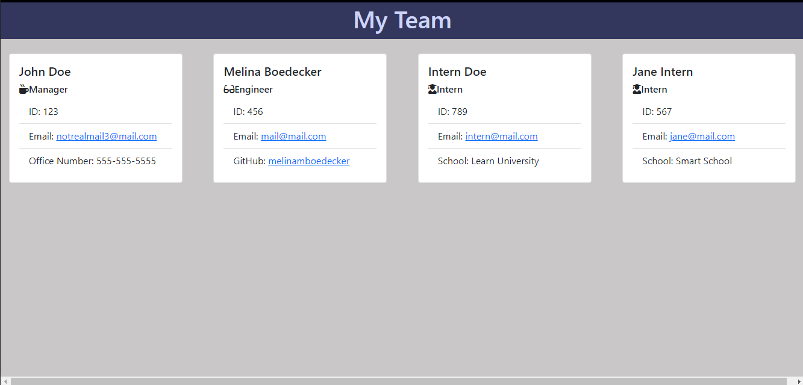

# Team Profile Generator
 
## Description: 
This is a Node.js command-line application that will create an HTML file of a team roster.  User is prompted for relevant input for each team member. The HTML file contains name, employee id, and email address for each employee.  Additional fields shown are the office number for the manager, GitHub username which links to the profile for each engineer, and also school name for each intern.  
## Table of Contents: 
* [Installation](#installation)
* [Usage](#usage) 
* [License](#license) 
* [Contributing](#contributing) 
* [Tests](#tests) 
* [Questions](#questions) 
## Installation: 
Run npm install from the main folder in your bash terminal to install dependencies.
## Usage: 
Run node index.js from the main folder in the command line of your bash terminal to start the application. Answer all the prompts, then when finished you will find your html file in the dist folder.

## License: 
Licensed under the [MIT](https://opensource.org/licenses/MIT) license. 
## Contributing: 
Feel free to contact me to contribute to this project. My contact information is listed below.
## Tests: 
Jest is used for testing. After running npm install from the main folder, run npm run test.
## Questions: 
GitHub: [melinamboedecker](https://github.com/melinamboedecker) 

If you have any additional questions, please contact me at melinamboedecker@gmail.com

